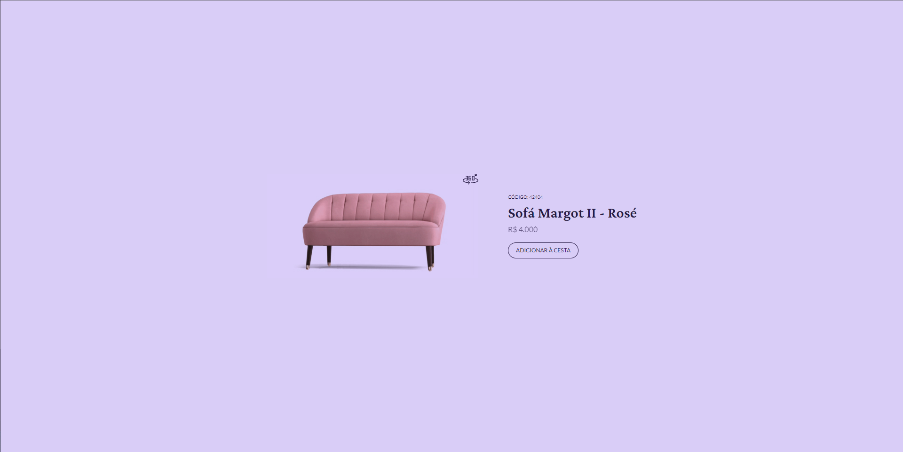
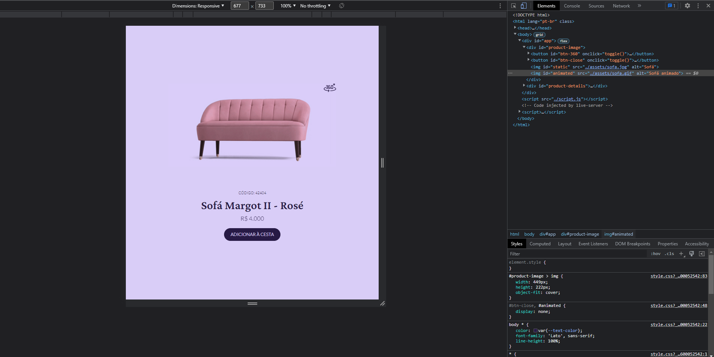

<h1><a href="https://project-card-ten.vercel.app/" target="_blank">Product Card🛋️</a></h1>

> Status: Terminado ✅

### Essa aplicação foi feita com intuito de resolver o desafio semanal da RocketSeat e de estudo

## Além do desafio, eu implementei algumas
+ Estilização do Botão 360 e do Closed com Hover do CSS
+ Estilização do Botão de "Adiciona à Cesta" 
+ Versão Responsiva do Site
+ Favicon adicionado

## Funcionalidades que estão em desenvolvimento: 
+ Já está completo! 🆗

## Tecnologias Usadas:

+ HTML5 🔶
+ CSS3 🔷
+ JavaScript 🟨
+ Git/Github 🐈‍⬛
## Algumas Imagens

#
